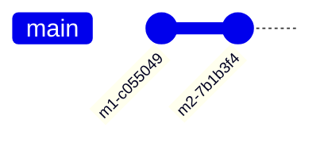
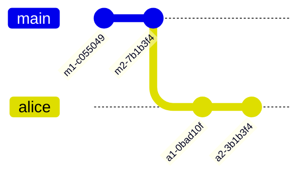
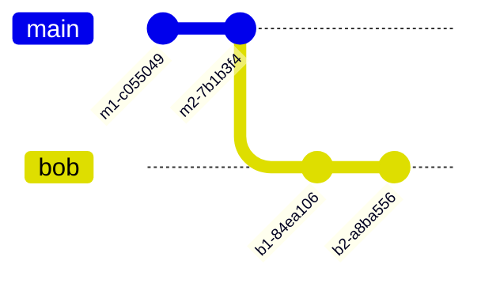
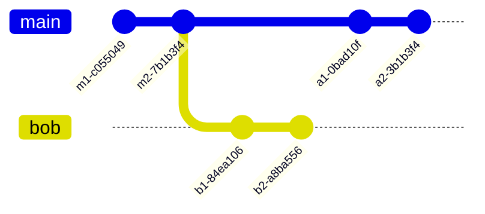
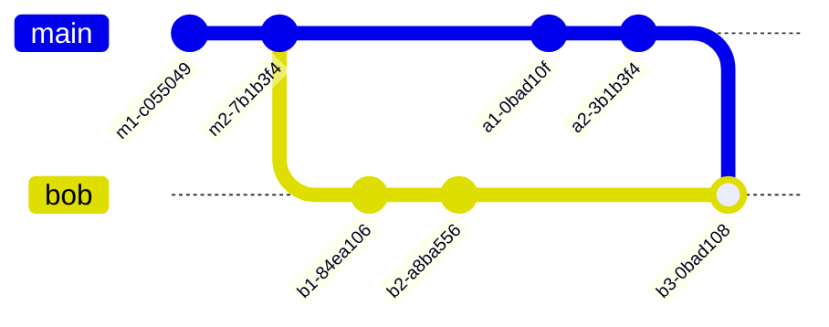
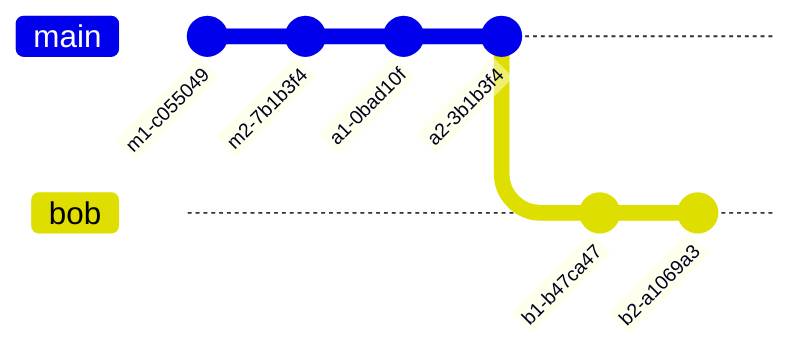
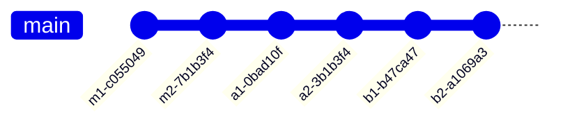

# Merge vs rebase

Wanneer je met meerdere personen samenwerkt aan dezelfde codebase, zul je de wijzigingen van anderen moeten integreren in je eigen werk. Meestal worden hiervoor zogenaamde "merge commits" gebruikt. Het probleem hiermee is dat hierdoor de historiek van de repository dan al snel ingewikkeld wordt. Een alternatief is om de wijzigingen van anderen te "rebasen" op jouw werk. Dit zorgt voor een veel eenvoudigere historiek, maar vraagt een zekere discipline.

Hieronder tonen we het verschil en hoe je een *rebase* uitvoert.

## Merge

Stel, Alice en Bob werken samen aan een project, en hebben elk een kloon gemaakt van de branch `main` op de Github-repository van hun team.



De commit-id's kan je als volgt interpreteren: `m1` en `m2` duiden de volgorde aan van deze commits op de `main` branch. De hexadecimale string stelt de hash voor van deze commit. Hieronder duiden we de commits van Alice aan met `a1` en `a2`, en die van Bob met `b1` en `b2`, eveneens gevolgd door een (fictieve) hash.

Alice heeft lokaal enkele nieuwe commits gemaakt. Zowel Alice als Bob werken gewoon op de `main` branch, dus aparte branches nemen we hier zelfs niet in rekening.



Intussen is ook Bob wijzigingen aan het maken:



Alice is de eerste die naar Git gepushed heeft, dus voor Bob is de situatie nu als volgt:



Als Bob een push naar Github wil doen, zal deze uiteraard geweigerd worden. Hij moet eerst de commits van Alice integreren in zijn lokale kopie. Bij een `git pull` zal Git een merge commit maken, d.w.z. een commit die de wijzigingen van Alice en Bob samenbrengt:



Na het eventueel oplossen van merge-conflicten kan Bob nu zijn werk naar Github pushen, maar de historiek is nu wel wat ingewikkeld. Wanneer je ook met meerdere mensen samenwerkt (die bv. ook nog eens andere combinaties van commits moeten mergen), kan dit al snel onoverzichtelijk worden.

## Rebase

Een alternatief is dat Bob eerst de commits van Alice binnen haalt, en dan zijn eigen commits achteraan in de historiek toevoegt. Dit heet een *rebase*.



Merk op dat de commit hashes van Bob nu veranderd zijn omdat de commits van Alice er nu voor staan. Dit is normaal bij een rebase. Bob kan nu zijn werk naar Github pushen, en de historiek is veel eenvoudiger:



Als elk teamlid deze manier van werken aanhoudt, blijft de historiek een stuk eenvoudiger om over te redeneren. Het principe is dus dat je de bestaande historiek niet wijzigt, en je eigen commits altijd achteraan toevoegt.

## Aanbeveling

Telkens wanneer je een `git pull` uitvoert, is het best dat je de optie `--rebase` meegeeft. Dit zorgt ervoor dat Git automatisch een rebase uitvoert in plaats van een merge.

Je kan Git zo instellen dat wanneer je een `git pull` uitvoert, Git automatisch een rebase doet in plaats van een merge. Dit doe je met de volgende commando's:

```console
> git config --global pull.rebase true
> git config --global rebase.autoStash true
```

De eerste regel zorgt ervoor dat Git standaard een rebase doet bij een pull, de tweede regel zorgt ervoor dat Git automatisch je eventuele lokale wijzigingen opzij zet en terug toepast na de rebase.
