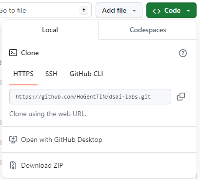

# Read-only gebruik van een repository

Als je enkel de inhoud van een repository wil bijhouden op je pc, dan kan je de repository clonen. Dit betekent dat je een lokale kopie maakt van de repository, inclusief de volledige historiek. Je kan dan de inhoud van de repository bekijken, maar je kan geen wijzigingen aanbrengen en je kan de wijzigingen van anderen niet pushen naar de repository. Sommige vakken zullen cursusmateriaal op deze manier ter beschikking stellen.

Ga naar de repository op GitHub via de link die je van de lectoren hebt gekregen. Klik op de groene knop "Code". Je vindt hier verschillende manieren om de repository te downloaden naar je eigen pc.



-   Met download ZIP haal je de laatste revisie van de code binnen als een zip-bestand. Je hebt echter geen historiek en kan latere wijzigingen aand e code op GitHub niet makkelijk bijhouden.
-   De HTTPS-link kan je gebruiken om de repository lokaal te klonen (d.w.z. een kopie downloaden met de volledige historiek). Hiermee heb je enkel leestoegang tot de repository. Kopieer de URL in het tekstveld.
-   De SSH-link zal je later leren gebruiken om ook schrijftoegang te krijgen tot een GitHub-repository.
-   GitHub CLI en GitHub Desktop zijn optionele tools om repositories te beheren, maar hier gaan we niet verder op in.

Open een terminal en navigeer naar de map waar je de repository wil clonen. Voer het volgende commando uit (maar dan met de URL die je daarnet gekopieerd hebt):

```console
> git clone https://github.com/USERNAME/REPOSITORY.git
```

Er wordt nu een nieuwe subdirectory aangemaakt met daarin de laatste toestand van de code zoals die nu ook op GitHub te zien is.

Als de code op de repository is aangepast, kan je de lokale kopie updaten met de laatste wijzigingen. Ga naar de map van de repository en voer het volgende commando uit:

```console
> cd REPOSITORY
> git pull
```

Let op: in deze opstelling is het niet de bedoeling dat je wijzigingen aanbrengt aan de code in de repository. Kopieer bestanden die je wilt wijzigen naar een andere directory buiten de repository.
