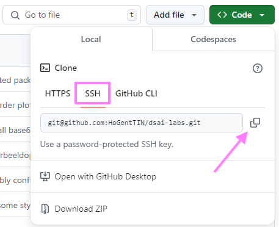

# Repository clonen

De eerste stap om bij te dragen aan een project is het clonen van de repository. Dit betekent dat je een lokale kopie van de codebase maakt op je eigen machine. Dit is handig omdat je dan lokaal wijzigingen kunt aanbrengen en deze later kan pushen naar de remote repository.

Om een repository te clonen, navigeer je naar de repository op GitHub en klik je op de groene knop "Code". Hier krijg je de optie om de URL van de repository te kopiëren. Kies hier voor de SSH-optie en kopieer de URL.



Open een terminal en navigeer naar de map waar je de repository wil clonen. Voer het volgende commando uit (maar dan met de URL die je daarnet gekopieerd hebt):

```console
> git clone git@github.com:USERNAME/REPOSITORY.git
```

Er wordt nu een nieuwe subdirectory aangemaakt met daarin de laatste toestand van de code zoals die nu ook op GitHub te zien is.
